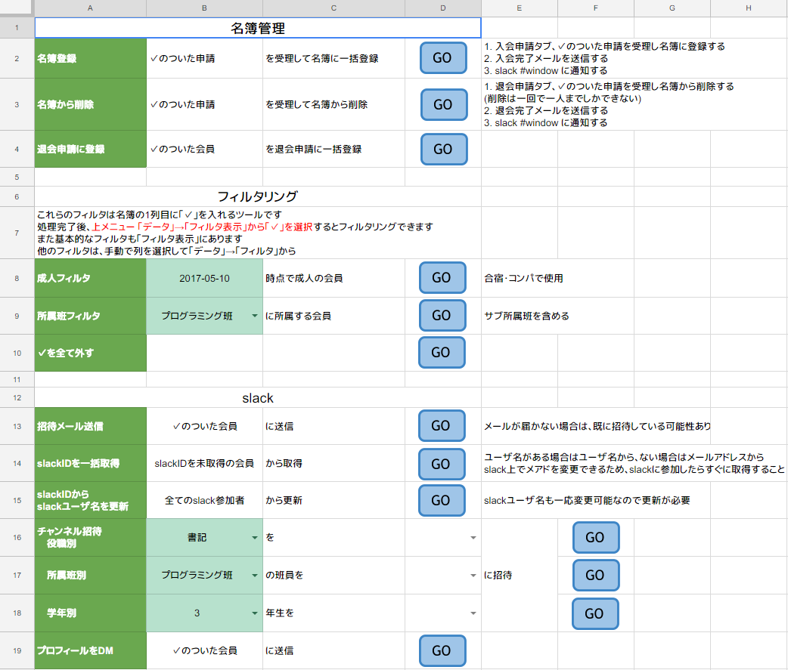

## 目次

1.  [Webのお話](#/2)
1.	[Google Apps Script](#/3)
1.  [Hello World](#/4)
1.  [カツ丼屋Webアプリを作る](#/5)

---

## 1. Webのお話

### 言語
- クライアントサイド: HTML, CSS, JavaScript
- サーバサイド: PHP, Ruby, Java, node.js
- データベース: SQL

|||

### Webアプリケーション
- Webブラウザ上で動くアプリ
- どのOSで動かすかは考えなくてよいのが利点
- ブラウザによって仕様が若干異なるのが欠点

|||

### WebAPI
- WebサービスをWeb経由で操作できるインターフェース
- Twitter, Google, Yahoo, bing, はてな、niconicoなど
- 自分のプログラムを強くできる

---

## 2. [Google Apps Script](https://developers.google.com/apps-script/) (GAS) 

- **JavaScript**でGoogleのAPIを使える環境
- ブラウザ上で完結し環境構築不要
- Googleのアカウントがあれば無料で使える
- Google以外のAPIもバンバン使える

|||

### カラクリ

- Googleの強いサーバー上で動く
- Google Drive上にスクリプトを置いて稼働させる
- 定期的に実行したり何らかのイベントに連動して発動できる

|||

### 何ができるの？

- 何かを自動化するシステムの開発
- Webアプリの開発

|||

### 例えば

#### 名簿管理システム

|||

#### 名簿管理システム

- フォームからきた申請を元にスプレッドシートで名簿を作成する
- 表なので学年ごとなどフィルタリングし放題
- 新規入会者に入会完了メールを送信する (Gmail)
- Slack API関連
    - Slackの招待メールを送信する
    - メアドを元にユーザ名(@hoge)を取得
    - チャンネルに招待する

Note:

個人情報のため見せられないよ！！！  
こっから全部スプレッドシート

|||

#### 教室申請システム

- フォームから申請を募り、事務に教室申請しやすくする
- 教室を確保したらカレンダーにイベントが自動生成する

Note:
実際に見せる

- [フォーム](https://docs.google.com/forms/d/e/1FAIpQLSfZdy9avFWeaNxn-pR76HZUxHJIjvaeJN5Lxo3UJY5GtWGZAg/viewform)
- [システム](https://docs.google.com/spreadsheets/d/1-aYjYnu_IzwWzPZfQVZlb5oN2yUJesuB65XNeplEqnw/edit?usp=sharing)

|||

#### カツ丼屋

- 教室申請システムで作成したカレンダーのイベントから、1ヶ月分の活動教室一覧を生成する

Note:
みんな知ってるけど実際に見せる

- [カツ丼屋](https://docs.google.com/spreadsheets/d/1fvfUGvMu-0BC8szunT2Uz6ti34XpdKEl3lnhHNupOG8)

|||

### こんな人におすすめ

- 組織内のシステムやサービスを構築したい
- 何かを自動化したい
- サーバーで常時稼働するサービスをタダで動かしたい
- なんかAPI叩きまくりたい

---

## 3. [Hello World](https://tonari-it.com/gas-web-application-beginner/)

---

## 4. カツ丼屋Webアプリを作る
